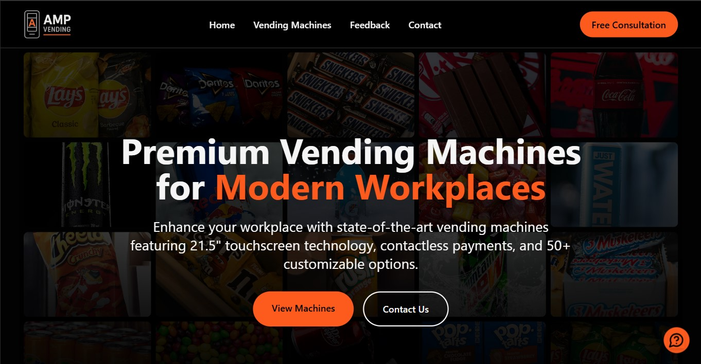
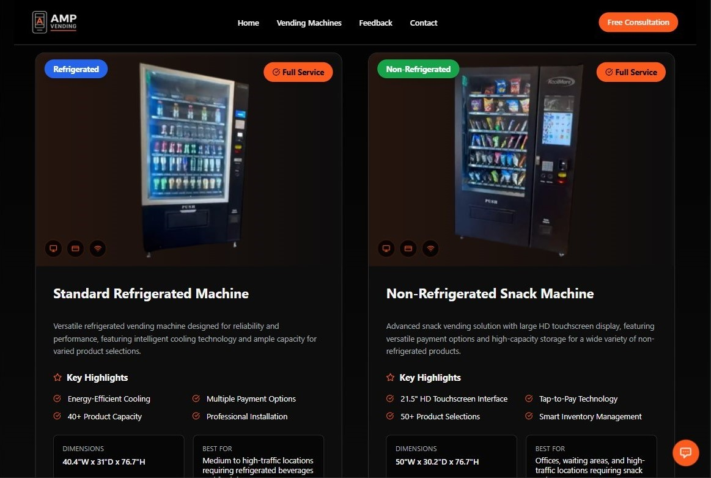
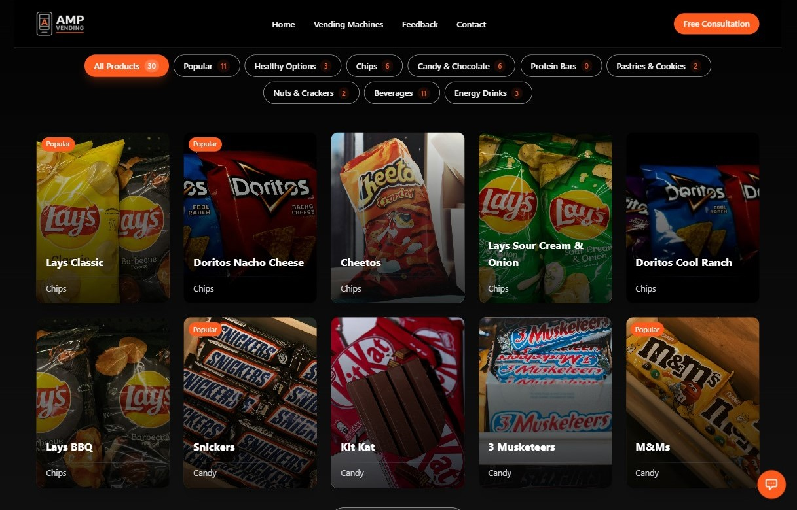
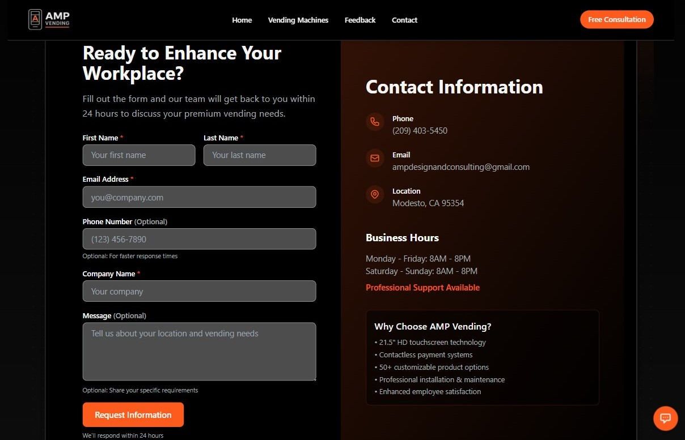

# AMP Vending - Advanced Workplace Vending Solutions

[](https://nextjs.org/)
[](https://www.typescriptlang.org/)
[](https://tailwindcss.com/)
[](https://www.framer.com/motion/)

**Transform your workplace with state-of-the-art vending machines featuring 21.5" touchscreen technology, contactless payments, and 50+ customizable product options.**

## 🌐 Live Website
**[https://www.ampvendingmachines.com](https://www.ampvendingmachines.com)**

## 📸 Website Preview

### Hero Section

*Advanced vending solutions with interactive hero showcasing latest technology*

### Vending Machines Showcase

*Premium vending machines with 21.5" touchscreen interfaces*

### Product Selection

*Customizable product options with smart categorization*

### Contact Form

*Professional contact interface with comprehensive business information*

## 🎯 Project Overview

AMP Vending is a modern, responsive website built for a vending machine company serving Central California. The platform showcases advanced vending solutions with comprehensive service packages, featuring cutting-edge technology and professional installation services.

### 🏢 Business Focus
- **Target Market**: Corporate offices, educational facilities, healthcare centers
- **Service Area**: Central California (Modesto, Stockton, Turlock, Manteca, Tracy)
- **Technology**: 21.5" HD touchscreen interfaces, contactless payments, smart inventory
- **Service Model**: Professional installation with full-service maintenance packages

## ✅ Implemented Features

### 🎨 Design & User Experience
- [✅] **Responsive Design** - Mobile-first approach with optimized breakpoints
- [✅] **Accessibility Compliant** - WCAG 2.1 AA standards with proper contrast ratios
- [✅] **Dark Theme** - Professional industrial aesthetic with orange accents
- [✅] **Smooth Animations** - Framer Motion powered interactions
- [✅] **Interactive Elements** - Hover effects, parallax scrolling, dynamic content

### 🚀 Performance & Technology
- [✅] **Next.js 14** - App Router with server-side rendering
- [✅] **TypeScript** - Type-safe development with comprehensive interfaces
- [✅] **Tailwind CSS** - Utility-first styling with custom design system
- [✅] **Image Optimization** - Next.js Image component with WebP support
- [✅] **Code Splitting** - Automatic code splitting for optimal loading

### 📱 Core Functionality
- [✅] **Homepage** - Comprehensive landing page with multiple sections
- [✅] **Vending Machine Showcase** - Detailed machine specifications and features
- [✅] **Product Gallery** - Interactive product selection with categories
- [✅] **Contact System** - Form handling with email notifications
- [✅] **Feedback System** - Customer feedback collection and management
- [✅] **Service Area Map** - Geographic coverage visualization

### 🔧 Technical Implementation
- [✅] **Form Validation** - Zod schema validation with error handling
- [✅] **Email Integration** - Resend API for automated email responses
- [✅] **Database Integration** - Supabase for data persistence
- [✅] **API Routes** - RESTful API endpoints for form submissions
- [✅] **Error Handling** - Comprehensive error boundaries and fallbacks

### 📊 SEO & Analytics
- [✅] **SEO Optimized** - Meta tags, structured data, sitemap
- [✅] **Schema Markup** - JSON-LD for enhanced search results
- [✅] **Open Graph** - Social media sharing optimization
- [✅] **Analytics Ready** - Google Analytics integration prepared

## 🎯 Recommended Features to Implement

### 🔐 Authentication & Admin Panel
- [ ] **Admin Dashboard** - Business metrics and analytics
- [ ] **User Authentication** - Secure login for business owners
- [ ] **Client Portal** - Customer account management
- [ ] **Machine Management** - Inventory and maintenance tracking

### 📊 Business Intelligence
- [ ] **Sales Analytics** - Revenue tracking and reporting
- [ ] **Inventory Management** - Real-time stock monitoring
- [ ] **Customer Insights** - Usage patterns and preferences
- [ ] **Maintenance Scheduling** - Automated service reminders

### 🌐 Enhanced User Experience
- [ ] **Machine Locator** - Interactive map with machine locations
- [ ] **Product Ordering** - Pre-order system for popular items
- [ ] **Loyalty Program** - Customer rewards and incentives
- [ ] **Mobile App** - Native mobile application
- [ ] **Live Chat** - Real-time customer support

### 🔧 Technical Enhancements
- [ ] **Progressive Web App** - PWA capabilities for mobile experience
- [ ] **Offline Support** - Service worker for offline functionality
- [ ] **Push Notifications** - Real-time updates and alerts
- [ ] **Multi-language Support** - Internationalization (i18n)
- [ ] **Advanced Caching** - Redis for improved performance

### 📈 Marketing & Growth
- [ ] **Blog System** - Content management for SEO
- [ ] **Newsletter Integration** - Email marketing campaigns
- [ ] **Referral System** - Customer referral rewards
- [ ] **Social Media Integration** - Instagram feed, reviews display
- [ ] **A/B Testing** - Conversion optimization tools

### 🛡️ Security & Compliance
- [ ] **Two-Factor Authentication** - Enhanced security for admin accounts
- [ ] **GDPR Compliance** - Privacy policy and cookie management
- [ ] **Rate Limiting** - API protection against abuse
- [ ] **Security Headers** - Enhanced security configuration
- [ ] **Audit Logging** - Comprehensive activity tracking

## 🛠️ Tech Stack

### Frontend
- **Framework**: Next.js 14 (App Router)
- **Language**: TypeScript 5.0
- **Styling**: Tailwind CSS 3.4
- **Animations**: Framer Motion
- **Icons**: Lucide React
- **Forms**: React Hook Form + Zod

### Backend
- **API**: Next.js API Routes
- **Database**: Supabase (PostgreSQL)
- **Email**: Resend API
- **Validation**: Zod Schemas
- **File Handling**: Next.js built-in support

### Development Tools
- **Package Manager**: npm
- **Linting**: ESLint + Prettier
- **Type Checking**: TypeScript compiler
- **Testing**: Jest + React Testing Library (recommended)
- **E2E Testing**: Playwright (recommended)

## 🚀 Getting Started

### Prerequisites
- Node.js 18.0 or higher
- npm or yarn package manager
- Git for version control

<!-- ### Installation

1. **Clone the repository**
   ```bash
   git clone https://github.com/yourusername/amp-vending-website.git
   cd amp-vending-website
   ```

2. **Install dependencies**
   ```bash
   npm install
   ```

3. **Environment Setup**
   ```bash
   cp .env.example .env.local
   ```
   
   Configure your environment variables:
   ```env
   # Database
   NEXT_PUBLIC_SUPABASE_URL=your_supabase_url
   NEXT_PUBLIC_SUPABASE_ANON_KEY=your_supabase_anon_key
   SUPABASE_SERVICE_ROLE_KEY=your_service_role_key
   
   # Email
   RESEND_API_KEY=your_resend_api_key
   FROM_EMAIL=noreply@yourdomain.com
   TO_EMAIL=contact@yourdomain.com
   
   # Google Maps (optional)
   NEXT_PUBLIC_GOOGLE_MAPS_API_KEY=your_google_maps_key
   ```

4. **Run the development server**
   ```bash
   npm run dev
   ```

5. **Open your browser**
   Navigate to [http://localhost:3000](http://localhost:3000)

### Build for Production

```bash
npm run build
npm start
``` -->

## 📁 Project Structure

```
amp-vending-website/
├── app/                          # Next.js App Router
│   ├── api/                      # API routes
│   │   ├── contact/route.ts      # Contact form handler
│   │   └── feedback/route.ts     # Feedback form handler
│   ├── contact/                  # Contact page
│   ├── feedback/                 # Feedback page
│   ├── vending-machines/         # Machines showcase
│   │   └── [id]/                 # Individual machine pages
│   ├── layout.tsx                # Root layout
│   ├── page.tsx                  # Homepage
│   ├── loading.tsx               # Loading UI
│   └── not-found.tsx             # 404 page
├── components/                   # React components
│   ├── contact/                  # Contact-related components
│   ├── hero/                     # Hero section components
│   ├── layout/                   # Layout components
│   ├── sections/                 # Homepage sections
│   ├── ui/                       # Reusable UI components
│   └── vending-machines/         # Machine-specific components
├── hooks/                        # Custom React hooks
├── lib/                          # Utility libraries
│   ├── data/                     # Data management
│   ├── services/                 # External service integrations
│   ├── schema/                   # Zod validation schemas
│   └── utils/                    # Helper functions
├── public/                       # Static assets
│   ├── images/                   # Image assets
│   │   ├── machines/             # Vending machine photos
│   │   ├── products/             # Product images
│   │   ├── beverages/            # Beverage images
│   │   └── preview/              # Website preview images
│   └── videos/                   # Video assets
└── styles/                       # Global styles
```

## 🎨 Design System

### Color Palette
```scss
--color-black: #000000        // Primary backgrounds
--color-dark-gray: #4d4d4d    // Secondary backgrounds
--color-silver: #A5ACAF       // Text and borders
--color-whitesmoke: #F5F5F5    // Primary text
--color-orange: #FD5A1E        // Accent and CTAs
--color-edward-gray: #a4acac   // Subtle elements
```

### Typography
- **Headings**: Inter (700 weight)
- **Body**: Inter (400-500 weight)
- **System**: Font family falls back to system fonts

### Responsive Breakpoints
```scss
sm: 640px    // Small tablets
md: 768px    // Tablets
lg: 1024px   // Laptops
xl: 1280px   // Desktops
2xl: 1536px  // Large screens
```


## 📝 License

This project is proprietary software owned by AMP Vending. All rights reserved.

## 📧 Contact

**AMP Vending**
- **Website**: [https://www.ampvendingmachines.com](https://www.ampvendingmachines.com)
- **Email**: [ampdesignandconsulting@gmail.com](mailto:ampdesignandconsulting@gmail.com)
- **Phone**: [(209) 403-5450](tel:+12094035450)
- **Location**: Modesto, CA 95354

<!-- ---

## 🚀 Deployment

### Vercel (Recommended)
1. Connect your GitHub repository to Vercel
2. Configure environment variables in Vercel dashboard
3. Deploy automatically on push to main branch

### Manual Deployment
```bash
npm run build
npm run export  # For static export (if configured)
``` -->

## 🔍 SEO Features

- **Meta Tags**: Comprehensive meta tag optimization
- **Structured Data**: JSON-LD schema markup
- **Sitemap**: Automatically generated XML sitemap
- **Robots.txt**: Search engine crawler instructions
- **Open Graph**: Social media sharing optimization
- **Twitter Cards**: Enhanced Twitter sharing
- **Canonical URLs**: Proper URL canonicalization


*Built using Next.js, TypeScript, and Tailwind CSS*


```
AMP-Vending-Machines-Website
├─ .eslintrc.json
├─ .husky
│  └─ _
│     ├─ applypatch-msg
│     ├─ commit-msg
│     ├─ h
│     ├─ husky.sh
│     ├─ post-applypatch
│     ├─ post-checkout
│     ├─ post-commit
│     ├─ post-merge
│     ├─ post-rewrite
│     ├─ pre-applypatch
│     ├─ pre-auto-gc
│     ├─ pre-commit
│     ├─ pre-merge-commit
│     ├─ pre-push
│     ├─ pre-rebase
│     └─ prepare-commit-msg
├─ app
│  ├─ accessibility
│  │  └─ page.tsx
│  ├─ admin
│  │  ├─ business-profile
│  │  │  └─ page.tsx
│  │  ├─ layout.tsx
│  │  ├─ page.tsx
│  │  └─ photo-manager
│  │     └─ page.tsx
│  ├─ api
│  │  ├─ contact
│  │  │  └─ route.ts
│  │  ├─ feedback
│  │  │  └─ route.ts
│  │  ├─ placeholder
│  │  │  └─ route.ts
│  │  └─ request-indexing
│  │     └─ route.ts
│  ├─ contact
│  │  ├─ Loading.tsx
│  │  └─ page.tsx
│  ├─ error.tsx
│  ├─ favicon.ico
│  ├─ feedback
│  │  ├─ layout.tsx
│  │  └─ page.tsx
│  ├─ global-error.tsx
│  ├─ globals.css
│  ├─ layout.tsx
│  ├─ manifest.ts
│  ├─ not-found.tsx
│  ├─ page.tsx
│  ├─ privacy-policy
│  │  └─ page.tsx
│  ├─ robots.txt
│  │  └─ route.ts
│  ├─ sitemap.xml
│  │  └─ route.ts
│  ├─ terms-of-service
│  │  └─ page.tsx
│  ├─ vending-machines
│  │  ├─ page.tsx
│  │  └─ [id]
│  │     └─ page.tsx
│  └─ viewport.ts
├─ components
│  ├─ about
│  │  ├─ AboutPage.tsx
│  │  ├─ CompanyStats.tsx
│  │  ├─ CompanyValues.tsx
│  │  ├─ OurStory.tsx
│  │  ├─ ServiceArea.tsx
│  │  └─ TeamSection.tsx
│  ├─ admin
│  │  ├─ AdminDashboardClient.tsx
│  │  ├─ AdminDashboardOverview.tsx
│  │  ├─ BusinessProfileManager.tsx
│  │  └─ PhotoManagerClient.tsx
│  ├─ contact
│  │  ├─ ContactEmailLink.tsx
│  │  ├─ ContactForm.tsx
│  │  ├─ ContactInfoSection.tsx
│  │  ├─ ContactMap.tsx
│  │  ├─ EmailLink.tsx
│  │  └─ FooterEmailLink.tsx
│  ├─ dev
│  │  └─ ResponsiveDebugger.tsx
│  ├─ feedback
│  │  ├─ FeedbackForm.tsx
│  │  └─ FeedbackWidget.tsx
│  ├─ forms
│  ├─ GoogleMapComponent.tsx
│  ├─ hero
│  │  ├─ BackgroundImages.tsx
│  │  └─ ResponsiveHero.tsx
│  ├─ landing
│  │  ├─ CTASection.tsx
│  │  ├─ FAQSection.tsx
│  │  ├─ GoogleMapComponent.tsx
│  │  ├─ HomeContactSection.tsx
│  │  ├─ HomePage.tsx
│  │  ├─ MachineShowcase.tsx
│  │  ├─ ProcessSection.tsx
│  │  ├─ ProductSection.tsx
│  │  ├─ ServiceAreaMapPreview.tsx
│  │  ├─ ServiceAreaSection.tsx
│  │  ├─ VendingMachineShowcase.tsx
│  │  └─ WorkplaceTransformSection.tsx
│  ├─ layout
│  │  ├─ Container.tsx
│  │  ├─ Footer.tsx
│  │  ├─ ResizableNavbar.tsx
│  │  ├─ ResponsiveGrid.tsx
│  │  ├─ Section.tsx
│  │  └─ Text.tsx
│  ├─ MachineCard.tsx
│  ├─ performance
│  │  └─ LazySection.tsx
│  ├─ seo
│  │  ├─ AboutBreadcrumbs.tsx
│  │  ├─ BreadcrumbSchema.tsx
│  │  ├─ GoogleIndexingOptimization.tsx
│  │  └─ MetaTags.tsx
│  ├─ ui
│  │  ├─ AnimatedComponent.tsx
│  │  ├─ core
│  │  │  ├─ Button.tsx
│  │  │  ├─ Card.tsx
│  │  │  ├─ Container.tsx
│  │  │  └─ Loading.tsx
│  │  ├─ effects
│  │  │  ├─ FlipWords.tsx
│  │  │  ├─ glare-card.tsx
│  │  │  └─ TypewriterEffect.tsx
│  │  ├─ forms
│  │  │  ├─ Input.tsx
│  │  │  ├─ Select.tsx
│  │  │  └─ Textarea.tsx
│  │  ├─ loading
│  │  ├─ multi-step-loader.tsx
│  │  ├─ shared
│  │  │  ├─ ClientOnly.tsx
│  │  │  ├─ HydrationSafeImage.tsx
│  │  │  ├─ Section.tsx
│  │  │  └─ SectionHeading.tsx
│  │  ├─ sonner.tsx
│  │  └─ Text.tsx
│  ├─ vending-machines
│  │  └─ FeatureTabs.tsx
│  └─ VendingMachineFooter.tsx
├─ components.json
├─ config
├─ docs
│  ├─ API.md
│  ├─ ARCHITECTURE.md
│  ├─ CHANGELOG.md
│  ├─ CONTRIBUTING.md
│  ├─ deployment
│  │  ├─ ci-cd.md
│  │  ├─ environment-vars.md
│  │  └─ vercel.md
│  ├─ DEPLOYMENT.md
│  ├─ development
│  │  ├─ coding-standards.md
│  │  ├─ component-library.md
│  │  ├─ performance.md
│  │  └─ setup.md
│  ├─ examples
│  │  ├─ api-examples.md
│  │  ├─ component-examples.md
│  │  └─ testing-examples.md
│  ├─ README.md
│  ├─ testing
│  │  ├─ accessibility.md
│  │  ├─ e2e-testing.md
│  │  └─ unit-testing.md
│  ├─ TESTING.md
│  └─ TROUBLESHOOTING.md
├─ e2e
│  └─ example.spec.ts
├─ eslint.config.mjs
├─ header-auth.tsx
├─ hooks
│  ├─ use-outside-click.ts
│  ├─ useBusinessProfile.ts
│  ├─ useEmail.ts
│  ├─ useHeroHighlight.ts
│  ├─ useHeroParallax.ts
│  ├─ useIntersectionObserver.ts
│  ├─ useIsClient.ts
│  ├─ useKeyboardNavigation.ts
│  ├─ useLocalStorage.ts
│  ├─ useMediaQuery.ts
│  ├─ useMouseEnter.ts
│  ├─ usePhotoUpload.ts
│  ├─ useResponsiveLayout.ts
│  ├─ useSafeAnimation.tsx
│  ├─ useUserInteractions.ts
│  └─ useVendingMachines.ts
├─ lib
│  ├─ business-card-utils.ts
│  ├─ config
│  │  └─ toast-config.tsx
│  ├─ createPlaceholderImage.ts
│  ├─ data
│  │  ├─ businessData.ts
│  │  ├─ photoOptimization.ts
│  │  ├─ seoData.ts
│  │  ├─ serviceAreas.ts
│  │  └─ vendingMachineData.ts
│  ├─ google-auth.ts
│  ├─ registry.tsx
│  ├─ resend.ts
│  ├─ schema
│  │  ├─ contactFormSchema.ts
│  │  └─ feedbackFormSchema.ts
│  ├─ services
│  │  ├─ analyticsService.ts
│  │  ├─ databaseService.ts
│  │  └─ emailService.ts
│  ├─ supabase-client.ts
│  ├─ supabase.ts
│  ├─ types.ts
│  ├─ utils
│  │  ├─ AnimationConfig.tsx
│  │  ├─ imageOptimization.ts
│  │  ├─ seo.ts
│  │  ├─ SEOOptimizedImage.tsx
│  │  └─ typeGuards.ts
│  └─ utils.ts
├─ next.config.js
├─ package-lock.json
├─ package.json
├─ postcss.config.js
├─ public
│  ├─ .well-known
│  │  └─ appspecific
│  │     └─ com.chrome.devtools.json
│  ├─ at-work
│  ├─ browserconfig.xml
│  ├─ exterior
│  ├─ favicon-16x16.png
│  ├─ favicon-32x32.png
│  ├─ file.svg
│  ├─ globe.svg
│  ├─ icons
│  │  ├─ apple-touch-icon.png
│  │  ├─ icon-192.png
│  │  └─ icon-512.png
│  ├─ images
│  │  ├─ additional
│  │  ├─ beverages
│  │  │  ├─ coke.jpg
│  │  │  ├─ drpepper.jpg
│  │  │  ├─ gatorade.jpg
│  │  │  ├─ justwater.jpg
│  │  │  ├─ monster.jpg
│  │  │  └─ RedBull.jpg
│  │  ├─ central-california-map.jpg
│  │  ├─ cover
│  │  ├─ interior
│  │  ├─ logo
│  │  │  ├─ AMP-QR-Code.jpg
│  │  │  ├─ AMP-Vending-Logo.jpg
│  │  │  └─ AMP_logo.png
│  │  ├─ logo-full.png
│  │  ├─ machines
│  │  │  ├─ amp-premium-non-refrigerated-vending-machine-front-bg.jpg
│  │  │  ├─ amp-premium-non-refrigerated-vending-machine-front-screen.png
│  │  │  ├─ amp-premium-non-refrigerated-vending-machine.jpg
│  │  │  ├─ amp-premium-touchscreen-vending-machine.png
│  │  │  ├─ amp-premium-touchscreen-vending-machine1.png
│  │  │  ├─ amp-premium-touchscreen-vending-machine2.png
│  │  │  ├─ amp-refrigerated-vending-machine.png
│  │  │  ├─ amp-refrigerated-vending-machine1.png
│  │  │  ├─ amp-standard-refrigerated-vending-machine.jpg
│  │  │  ├─ amp-standard-refrigerated-vending-machine.png
│  │  │  ├─ amp-vending-machines.jpg
│  │  │  ├─ compact-refrigerated-vending-machine.jpg
│  │  │  └─ standard-non-refrigerated.jpg
│  │  ├─ og
│  │  │  └─ default-og-image.jpg
│  │  ├─ placeholder.jpg
│  │  ├─ preview
│  │  │  ├─ contact-form-preview.jpg
│  │  │  ├─ hero-section-preview.jpg
│  │  │  ├─ machines-showcase-preview-2.jpg
│  │  │  ├─ machines-showcase-preview.jpg
│  │  │  └─ products-section-preview.jpg
│  │  ├─ products
│  │  │  ├─ 7-up.jpg
│  │  │  ├─ candy.jpg
│  │  │  ├─ cheetos.jpg
│  │  │  ├─ cocacolazero.jpg
│  │  │  ├─ coke.jpg
│  │  │  ├─ dietcoke.jpg
│  │  │  ├─ doritos-cool-ranch.jpg
│  │  │  ├─ doritos-nacho-cheese.jpg
│  │  │  ├─ doritos.jpg
│  │  │  ├─ drpepper.jpg
│  │  │  ├─ fanta.jpg
│  │  │  ├─ gatorade.jpg
│  │  │  ├─ gummy-bears.jpg
│  │  │  ├─ gummy-worms.jpg
│  │  │  ├─ kit-kat.jpg
│  │  │  ├─ kitkat.jpg
│  │  │  ├─ lays-bbq.jpg
│  │  │  ├─ lays.jpg
│  │  │  ├─ layssourcream.jpg
│  │  │  ├─ layssourcream.png
│  │  │  ├─ mms.jpg
│  │  │  ├─ monster.jpg
│  │  │  ├─ mountaindew.jpg
│  │  │  ├─ orange-crush.jpg
│  │  │  ├─ orangecrush.jpg
│  │  │  ├─ oreo.jpg
│  │  │  ├─ peanuts.jpg
│  │  │  ├─ Pepsi.jpg
│  │  │  ├─ placeholder.jpg
│  │  │  ├─ placeholder.svg
│  │  │  ├─ planters.jpg
│  │  │  ├─ poptarts.jpg
│  │  │  ├─ redbull-blue.jpg
│  │  │  ├─ redbull-purple.jpg
│  │  │  ├─ redbull-red.jpg
│  │  │  ├─ redbull-sf.jpg
│  │  │  ├─ redbull-yellow.jpg
│  │  │  ├─ redbull.jpg
│  │  │  ├─ ritz (2).jpg
│  │  │  ├─ ritz.jpg
│  │  │  ├─ rockstar-fruit-punch.jpg
│  │  │  ├─ root-beer (13).jpg
│  │  │  ├─ root-beer (6).jpg
│  │  │  ├─ root-beer.jpg
│  │  │  ├─ skittles.jpg
│  │  │  ├─ snickers.jpg
│  │  │  ├─ sour-patch-eneygy.jpg
│  │  │  ├─ Sprite.jpg
│  │  │  ├─ starburst.jpg
│  │  │  └─ threemusketeers.jpg
│  │  ├─ team
│  │  └─ ui
│  │     └─ central-california-map.jpg
│  ├─ map-marker.svg
│  ├─ next.svg
│  ├─ sw.js
│  ├─ vercel.svg
│  └─ window.svg
├─ README.md
├─ scripts
│  ├─ generate-placeholders.ts
│  ├─ lighthouse-test.ts
│  ├─ monitor-indexing.ts
│  ├─ request-indexing.ts
│  └─ test-google-auth.ts
├─ supabase
│  ├─ .temp
│  │  ├─ cli-latest
│  │  ├─ gotrue-version
│  │  ├─ pooler-url
│  │  ├─ postgres-version
│  │  ├─ project-ref
│  │  ├─ rest-version
│  │  └─ storage-version
│  └─ migrations
│     ├─ 20250417190308_new-migration.sql
│     └─ 20250418050658_new-migration.sql
├─ tailwind.config.ts
├─ tests
│  ├─ e2e
│  │  ├─ accessibility-comprehensive.spec.ts
│  │  ├─ accessibility.spec.ts
│  │  ├─ contact-flow.spec.ts
│  │  ├─ homepage.spec.ts
│  │  ├─ performance.spec.ts
│  │  ├─ vending-machines.spec.ts
│  │  └─ visual-regression.spec.ts
│  ├─ jest-axe-setup.js
│  ├─ jest.config.js
│  ├─ jest.setup.js
│  ├─ playwright.config.ts
│  ├─ responsiveChecklist.md
│  ├─ setup.tsx
│  ├─ unit
│  │  └─ components
│  │     ├─ ContactForm.test.tsx
│  │     └─ FeedbackForm.test.tsx
│  ├─ utils
│  │  └─ test-helpers.ts
│  ├─ __mocks__
│  │  ├─ fileMock.js
│  │  ├─ framer-motion.js
│  │  └─ next-auth.js
│  └─ __tests__
│     └─ components
│        └─ ContactForm.test.tsx
├─ tsconfig.json
├─ types
│  ├─ google-maps.d.ts
│  └─ index.ts
└─ vercel.json

```